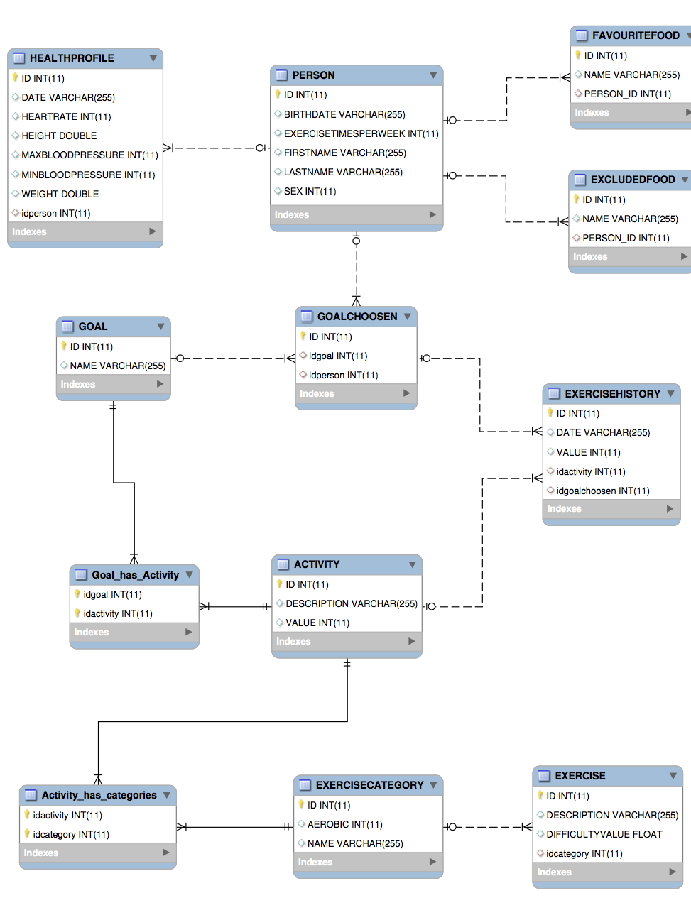

##Storage Service
This is a simple storage service that allows you to communicate with a MySql database. 

####Explanation of the API
You can access the API through a soap service. For each entity in the database there is a Port, which mostly contains the CRUD methods necessary 'Create' 'Read' 'Update' 'Delete' the entities in the database.

####How to comunicate
To start communicate with this server follow these steps:

1. Install mysql server in your machine [MySql Download](http://www.mysql.it/downloads/)
2. Start mysql server 
    - <b>Unix</b>: Go into /usr/local/mysql/support-files and run `mysql.server start` (Ensure you have 755 permission in that folder to start he server, otherwise you will get an error!)
3. Run Publisher class of Storage Service
4. Run Main of Client Project to test if it is works!

####ER Diagram

####MySql Workbench
Nice tool to manipulate databases! [Download MySql Workbench](http://dev.mysql.com/downloads/tools/workbench/)
