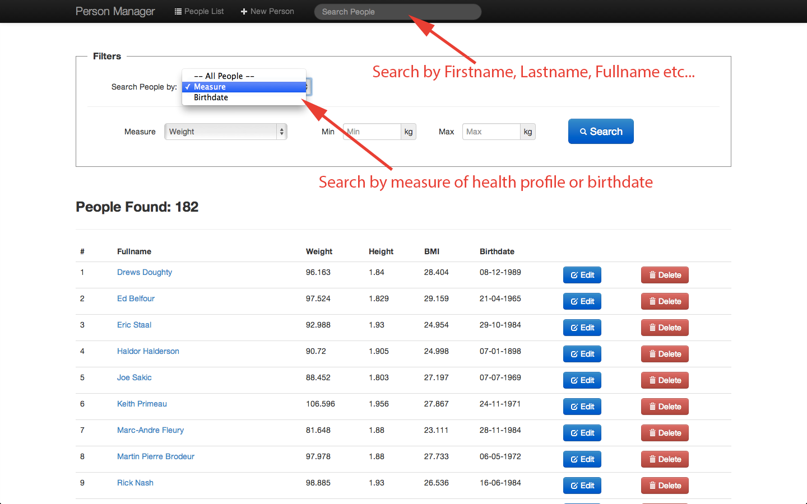
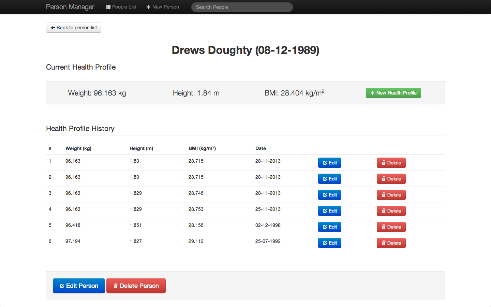
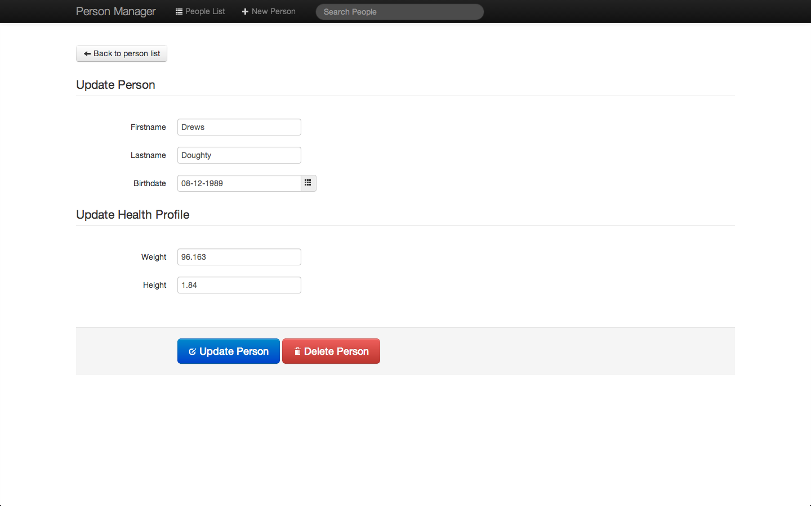

DOCUMENTATION Assignment #2: Francesco Maturi & Lorenzo Rigato
===========

All code is available @ [our github repository](https://github.com/francescomaturi/assignment2).

#Services Documentation:

## Motivational Quotes

**GET  http://inspirationalquotes.herokuapp.com/random_quote**

#####Response Example:

{
    "content": "\n“True leadership lies in proving that the people at top can lead-by-example 
    to motivate and inspire their team relentlessly.”\n",
    
    "created_at": "2013-12-24T11:19:51Z",
    
    "id": 597,
    
    "updated_at": "2013-12-24T11:19:51Z"
}

Hibernate Configuration:
----------------
The database used is in `database/mydb.db`, we need to configure hibernate to find it: please go to 
`src/main/resources/hibernate.cfg.xml` file and at connection url property type the following:

* For Mac users: `jdbc:sqlite:database/mydb.db`
* For Unix users: `jdbc:sqlite:<your_directory>/<path_to_this_project>/database/mydb.db`

Database:
----------------
The database used is sqlite, it contains all ice hockey 
people from Ontario present in [dbpedia.org](http://dbpedia.org/About).

To fetch and parse data from dbpedia it was used [Apache Jena](http://jena.apache.org/): a free and open source Java framework for building Semantic Web and Linked Data applications. 

REST Service:
----------------
All our services support both json and xml format for response. 
To specify the response format just set the header `Accept: application/json` or `Accept: application/xml` for the type you require.

Here is the list of our rest services:

**GET  /person**

Returns the list of all the people in the database 

**POST  /person**

Creates a new person in our database and returns it with the generated identifier that can be used after to access to that person. The person object you want to create should be passed as body of the request. This method support both json and xml request format. Just set the header `Content-Type: application/json` or `Content-Type: application/xml` . For example the body of a json request could be: `{"firstname":"Francesco","lastname":"Maturi","birthdate":"27-01-1990","height":"1.89","weight":"89.2"}`.

**GET  /person/{p_id}**

Returns the person associated to that specific **p_id**. The person object is returned with the current healthprofile and also le list of healthprofile_ids of that person. If there isn't a person associated with the given **p_id** the response status will be 204 NO_CONTENT.

**PUT  /person/{p_id}**

This method is for updating the person information like firstname, lastname, birthdate or the current weight and height. The updated person object should be passed as body of the request. This method support both json and xml request format. Just set the header `Content-Type: application/json` or `Content-Type: application/xml`. For example the body of a json request could be: `{"firstname":"Francesco","lastname":"Maturi","birthdate":"27-01-1990","height":"1.89","weight":"89.2"}`. If weight and height are also updated will be saved in the healthprofile history the old healthprofile. The person updated will be returned in the body of the response.

**DELETE  /person/{p_id}**

Delete the person identified by that specific **p_id** and also his healthprofile history. This method returns to the caller all the information that are deleted.

**GET  /person/{p_id}/healthprofile**

Returns the specified person with all the data relating to its healthprofile history.

**POST  /person/{p_id}/healthprofile**

Updates the new healthprofile of the specified person. The current healthprofile of this person will be put in his healthprofile history and replaced by the updated data that are given. This method support both json and xml request format. Just set in the headers what you prefer `Content-Type: application/json` or `Content-Type: application/xml`. For example the body of an xml request could be: `<healthProfile><height>1.74</height><weight>70.3</weight></healthProfile>`. The response will be the updated person with all the data relating to its healthprofile history.

**GET  /person/p_id/healthprofile/hp_id**

Returns the specified healthprofile of the specified person. If there isn't an healthprofile identified by **hp_id** associated to the given **p_id** the response will be 204 NO_CONTENT.

**PUT  /person/p_id/healthprofile/hp_id**

Updates weight and height of the specified healthprofile of the specified person. This method support both json and xml request format. Just set in the headers what you prefer `Content-Type: application/json` or `Content-Type: application/xml`. For example the body of an xml request could be: `<healthProfile><height>1.80</height><weight>75.3</weight></healthProfile>`. The response will contains be the updated healthprofile.

**DELETE  /person/p_id/healthprofile/hp_id**

Delete the specified healthprofile. The data removed from the database will be returned in the response.

**GET  /search/birthdate?from=DD-MM-YYYY&to=DD-MM-YYYY**

Returns all the people that have the birthday in the specified range.

**GET  /search/profile?measure={height|weight}&min=MIN&max=MAX**

Returns all the people that are in the specified range of height or weight.

**GET  /search/name?q=TEXT_TO_SEARCH**

Returns the people that have firstname or lastname matching the TEXT_TO_SEARCH 

Client
----------------

This is a simple introduction to understand how to use that web application.

This client is implemented using [Backbone.js](http://backbonejs.org/) which is a javascript library that easily allows to make REST request and manage their response on a html page.

### Usage

Start tomcat, open your browser and navigate the the follow url: `http://localhost:8080/RESTService/`

It will show a view that contains the list of the people contained in the database 
like the following screenshot.

You can also search people by Firstname, Lastname, Fullname etc, 
just typing something in the search bar in the navbar on top.

Also, you can search people by their weight, height or birthdate just filling the filter form and press "Search" button.

If you click on a specific person it will show a view in which there are all the informations of that person, his current health profile and his health profile history.

You can add a new health profile for that person (in this case the previous one will be shown in the health profile history table), or edit / delete each health profile present in the history.

Finally you can also edit or delete that person.

Just for an example, the following screenshot contains the form for the editing of a person.

### Chrome and CORS Request

To make a request outside our domain we have to set a flag for google chrome that allows make requests for any domain.

**MAC users:**
write on terminal `alias chrome="open /Applications/Google\ Chrome.app/ --args --disable-web-security"`

**OTHER users:**
write on terminal `alias chrome="open <Your_Google_Chrome_path> --args --disable-web-security"`

With that command we create an alias to chrome to open it without web security flag so we can make requests to any
from our local files.