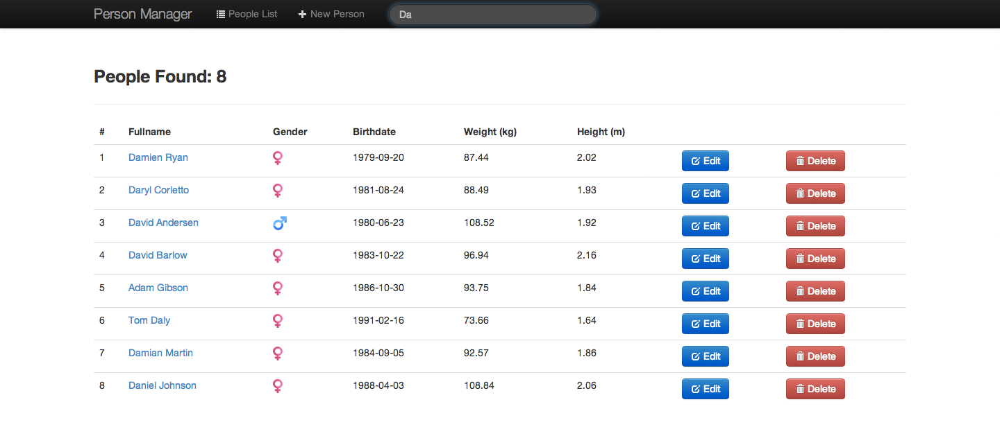
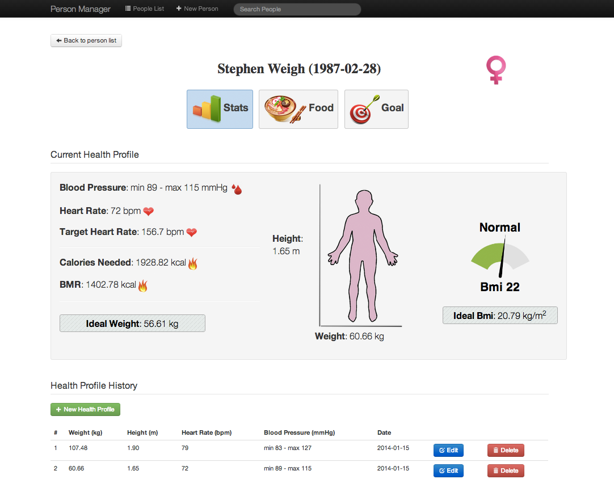
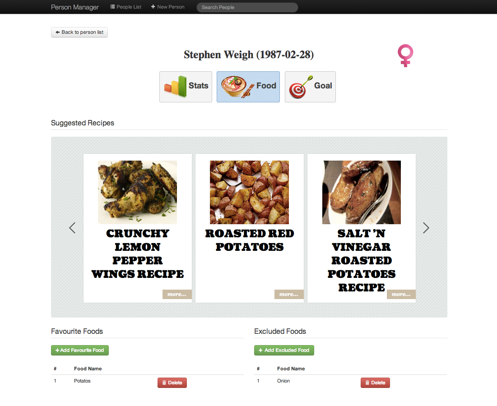
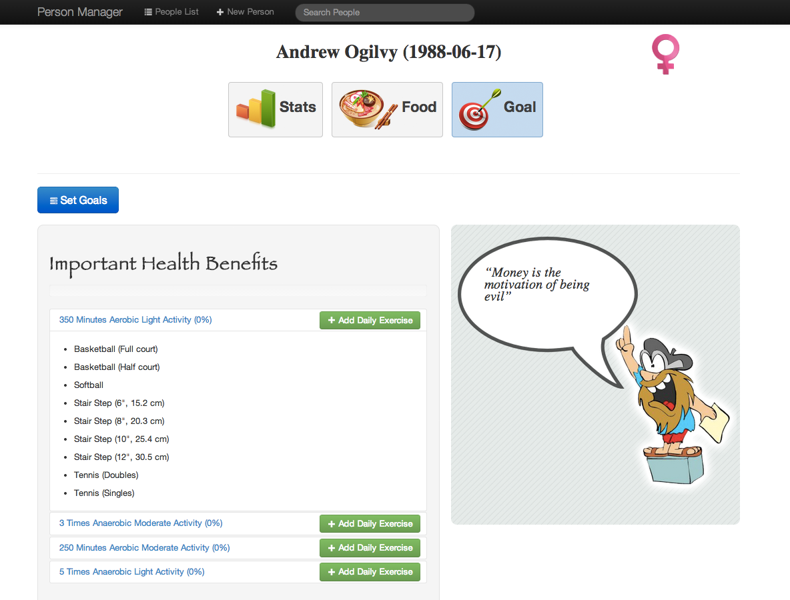

##Client
<br/>


This client is implemented using [Backbone.js](http://backbonejs.org/)
 which is a javascript library that easily allows to make REST request and manage their response on a html page.

#### Usage

Open file index.html inside ```WebAppRest/src/main/webapp``` folder.

It will show a view that contains the list of the people contained in the database 
like the following screenshot.



You can also filter people just typing something in the search bar in the navbar on top.
Automatically it will shown people which firstname or lastname match with that query.

If you click on a specific person it will show a view in which there are all the informations of that person.



First of all, in the "Stats" page there are all the informations of health profile, heart rate, blood pressure, weight, bmi for that person.

You can find ideal some values for that person such as the calories needed, the ideal weight and the ideal bmi.

You can also add a new health profile for that person (in this case the previous one will be shown in the health profile history table), or edit / delete each health profile present in the history.

Finally you can also edit or delete that person.



In "Food" page the user can find some suggested recipes.
These recipes are based on favourited and excluded food of that person.
Excluded food is very important in case this person have some problems with a particular food or simply he don't like it.
The system provide recipes (if it is possible) that contains the favourite foods and not contains the excluded foods.



In the "Goal" page the user can set his goals and add their daily exercises.

#### Chrome and CORS Request

To make a request outside our domain we have to set a flag for google chrome that allows make requests for any domain.

**MAC users:**
write on terminal `alias chrome="open /Applications/Google\ Chrome.app/ --args --disable-web-security"`

**OTHER users:**
write on terminal `alias chrome="open <Your_Google_Chrome_path> --args --disable-web-security"`

With that command we create an alias to chrome to open it without web security flag so we can make requests to any
from our local files.